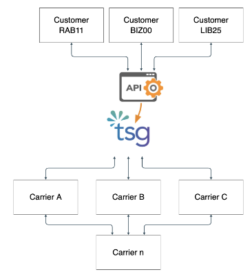

## TSG Global | Take Home Project

### Telecom Rating Engine

Thanks again for applying for a job at TSG Global!

We’d like to better assess your technical skills and have developed a messaging and voice call detail record (CDR) “rating engine” project to better understand how you think. This test should generally take few hours to complete. If you need clarification about an ask on the test, just send us an email at developers@tsgglobal.com and we’ll respond promptly. Please read this entire document first, including the overall evaluation criteria, before starting on your solution.

## Overview

#### Definitions

**Call Detail Record (CDR)**

a row of data that contains to/from number, client ID and name, direction of the message/call, service type, success, number of units used, and carrier used

**Short Message Service (SMS)**

a text-only messaging service

**Multimedia Messaging Service (MMS)**

a text and multimedia messaging service (photos, video, audio, etc.)

**Voice Calls**

Time-based audio communication between two telephone numbers.

Customers RAB11, BIZ00, and LIB25 are all TSG Global customers who consume our APIs. They use TSG Global, and our inventory of phone numbers, to send/receive SMS messages, MMS messages, and/or voice calls.

TSG Global uses our vendors - telecom carriers named A, B, and C - to purchase numbers and to receive and deliver these SMS, MMS, and voice calls.

TSG Global pays a per-unit fee for all inbound and outbound messaging and voice calls to our carriers. These per-unit fees are different between carriers, and can change every few months.

TSG Global bills our customers based on CDRs, meaning that they are billed based on the amount of units used, the buy rate associated with the carrier used, and the customer-specific sell rate.

We are providing you three sample CSVs:

*   Some buy rates that we pay our vendor carriers (per-unit).
*   Some sell rates that we charge our customers (per-unit).
*   Some 200 call detail records (CDRs) include the information necessary to appropriate “rate” the CDRs based on the previous two files.

Your take home project consists of up to three steps:

*   create a POST JSON API that acts as a data importer (which should read, decode, rate, and store data included in the provided CDRs CSV, as well as accept new CDRs)
*   create a simple GET JSON API to pull customer billing information (based on CDRs)

## Step 1) Create a CDR importer for rating

#### Task

TSG Global processes both inbound and outbound messages/voice calls from telephone numbers owned by TSG Global. TSG Global pays per-unit rates to carriers A, B, C based on the direction of the message/call (inbound/outbound) and the type of service (SMS/MMS/voice). These per-unit rates change dynamically every few months. Your first step is to create a backend system which should read the supplied 200 line CDR file, as well as accept new CDRs via a POST, and accurately decode, rate, and store to a database the appropriate amounts a customer should be charged. Each CDR’s cost to the customer is formed by **summing** the **carrier buy rate** (what we pay the carrier) and the **customer sell rate** (our margin), per unit.

_Note: customers should **not** be charged for services with success status of “false”._

##### POST - New Call Detail Record (CDR)

With this public API, we should be able to add a new service provided (**SMS/MMS/VOICE sent/received successfully**) and data should be stored in the database and rated properly. The service timestamp should be default to **now**, and the other data fields should be provided in the request body.

**Note: part of the evaluation will include us POSTing new CDRs to your API (after first evaluating how you rated/billed the existing 200 line CDR CSV).**

The provided CSV files to help with this task are:

#### Buy Rates - buy_rates.csv

This file contains example information about current wholesale rates (costs) for services provided by carriers that TSG Global buys from. If the service-carrier rate pair for some service is missing, that means that carrier doesn’t provide that service to TSG Global.

Columns mappings are following:

1. Carrier name
2. Rating start date
3. SMS rate (per unit)
4. MMS rate (per unit)
5. Voice rate (per unit)
6. Direction

#### Sell Rates - sell_rates.csv

This file contains example current TSG Global pricing for voice/messaging transport that we offer to businesses. Individual clients have different service fees for different services. If any data is missing, that means we don’t provide such service for this client at the moment.

Columns mappings are following:

1. Client code
2. Price start date
3. SMS fee (per unit)
4. MMS fee (per unit)
5. Voice fee (per unit)
6. Direction

#### Call Detail Records (CDRs) - cdrs.csv

This file contains example rows of data about a service we provided to the client (client succeeded to send/receive a message or call/received a call).

Columns mappings are as follows:

1. Client code
2. Client name
3. Source number (number that initiated the service)
4. Destination number
5. Direction:
*   Inbound - if client received message/call
*   Outbound - if client sent message or made a call
6. Service type (SMS, MMS or Voice)
7. Number of units (voice calls are duration-based, not instantaneous)
8. Success (true or false)
9. Carrier
10. Timestamp_UTC

## Step 2) Create a GET billing JSON API

#### Task

Now that you have some code/an API that can correctly ingest the CDR data data provided to you, we’d like a way to query (GET) a client and see what their monthly bill currently is. Please create another JSON API with a public endpoint that we can query.

#### GET - Client Monthly Service Charges

For a provided **client code, month, and year,** your API should return the information about the **total services provided, total cost per service, and grand total across all services.**

##### Example

<table>
  <tr>
   <td>Service
   </td>
   <td>Count (successful units)
   </td>
   <td>Total price
   </td>
  </tr>
  <tr>
   <td>SMS
   </td>
   <td>22
   </td>
   <td>2.50
   </td>
  </tr>
  <tr>
   <td>MMS
   </td>
   <td>4
   </td>
   <td>0.40
   </td>
  </tr>
  <tr>
   <td>TOTAL
   </td>
   <td>26
   </td>
   <td>2.90
   </td>
  </tr>
</table>

**Note: part of the evaluation will be using your GET operations for monthly client charges after POSTing new CDRs for the current month.**

## Overall Evaluation criteria

Your solution can be submitted in any language of your preference but bonus points will be scored for submitting an Elixir solution.

We are looking for **production ready, clean, readable, performant and maintainable code.**

Please use THIS GitHub repository to upload your code (feel free to reorganize/delete current files as you like). Feel free to commit as you work - we will only review it once you let us know it's done.

Please include a readme with the prerequisites and detailed instructions on how to run the solution. Since this is not expected to be a production ready code you are allowed to take shortcuts to reduce your development time, but if any assumptions or trade-offs have been made, those should be documented (comment in code or in your project readme is fine). If you don't complete some part of the assignment it is ok to submit partial solution for review, but please provide an explanation why wasn't this completed and how would you complete it if this had to be production ready code or where did you get stuck or which issues you ran into.

Once you are complete, simply let us know - and we will be in touch within the next few days to schedule the tehnical interview. Technical interview which discussion about this solution and some general tehnical questions related to the position you are interviewing for.

